# Laporan Proyek Machine Learning - Ahmad Rizky #

## Domain Proyek ##
Masalah yang diangkat pada proyek ini berada pada domain **Kesehatan**. Menurut Riskesdas dalam Delima et al. (2016), stroke adalah penyakit penyebab kematian tertinggi di Indonesia, yaitu sebesar 15,4%. Oleh karena itu, diagnosis stroke sedari dini penting untuk dilakukan. Proyek ini mencoba untuk melakukan diagnosis stroke berdasarkan riwayat diri dan kesehatan pasien, seperti pekerjaan, tempat tinggal, level glukosa dalam darah, dan komorbid lainnya.

## Business Understanding ##
### Problem Statement ###
"Bagaimana cara diagnosis penyakit stroke menggunakan pendekatan Machine Learning?"
### Goal ###
"Pembuatan model dengan pendekatan Machine Learning untuk diagnosis penyakit stroke."
### Solution Statements ###
- Membuat 2 model dari pendekatan Machine Learning untuk diagnosis penyakit stroke
- Mengevaluasi model terbaik dengan membandingkan nilai mean squared error dan accuracy dari tiap model.

## Data Understanding ##
Dataset yang digunakan dalam proyek ini adalah **Stroke Prediction Dataset**. Dataset ini dapat diunduh pada tautan https://www.kaggle.com/datasets/fedesoriano/stroke-prediction-dataset.
### Fields pada Dataset ###
Dataset ini berisi 5110 record dengan 12 field. Field yang ada pada dataset ini adalah:
- id: primary key untuk tiap record
- gender: jenis kelamin pasien. Distinct value: Male, Female, and Other 
- age: usia pasien
- hypertension: apakah pasien memiliki penyakit darah tinggi? 0 berarti tidak, 1 berarti iya
- heart_disease: apakah pasien memiliki komorbid penyakit hati? 0 berarti tidak, 1 berarti iya
- ever_married: status perkawinan pasien. Distinct value: Yes and No
- work_type: status pekerjaan pasien. Distinct value: children, Govt_job, Never worked, Private, and Self-employed
- Residence_type: tempat tinggal pasien. Distinct value: Rural and Urban
- avg_glucose_level: rerata kadar glukosa dalam darah pasien
- bmi: indeks massa tubuh
- smoking_status: status pasien dengan rokok. Distinct value: formerly smoked, never smoked, smokes, unknown
- stroke: field target, status stroke pasien. 0 berarti tidak, 1 berarti iya
### Tahapan Data Understanding ###
Tahap-tahap yang dilakukan dalam memahami data, adalah:
- memvisualisasikan fitur numerik menggunakan boxplot <br>
  Gambar 1 Boxplot fitur age: <br>
  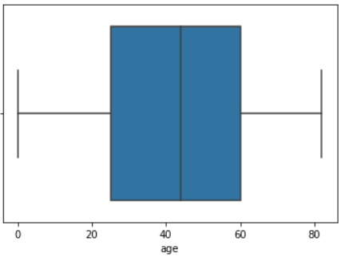 <br><br>
  Gambar 2 Boxplot fitur avg_glucose_level: <br>
  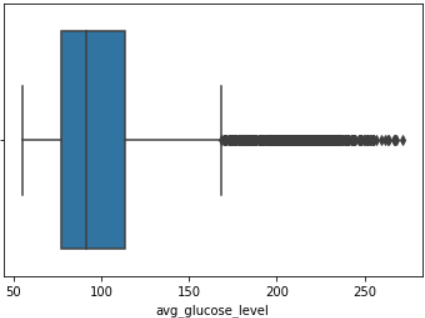 <br><br>
  Gambar 3 Boxplot fitur bmi: <br>
  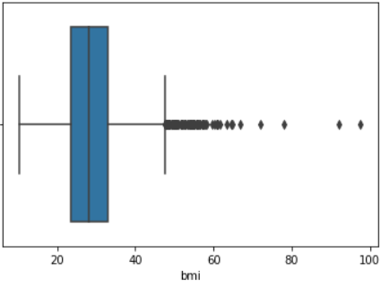 <br>
- memvisualisasikan fitur kategorik menggunakan barplot <br>
  Gambar 4 Barplot fitur gender: <br>
  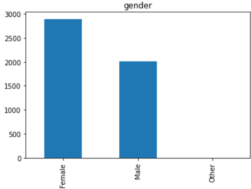 <br><br>
  Gambar 5 Barplot fitur ever_married: <br>
  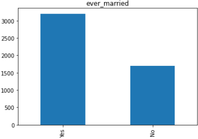 <br><br>
  Gambar 6 Barplot fitur work_type: <br>
  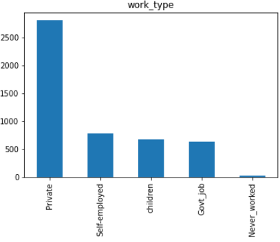 <br><br>
  Gambar 7 Barplot fitur Residence_type: <br>
  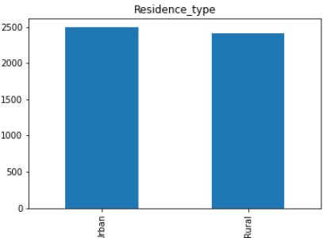 <br><br>
  Gambar 8 Barplot fitur smoking_status: <br>
  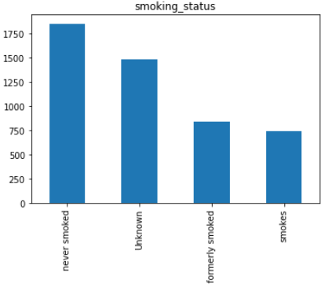 <br>
- memvisualisasikan korelasi fitur kategorik dengan fitur target menggunakan catplot <br>
  Gambar 9 Catplot fitur stroke vs fitur gender: <br>
  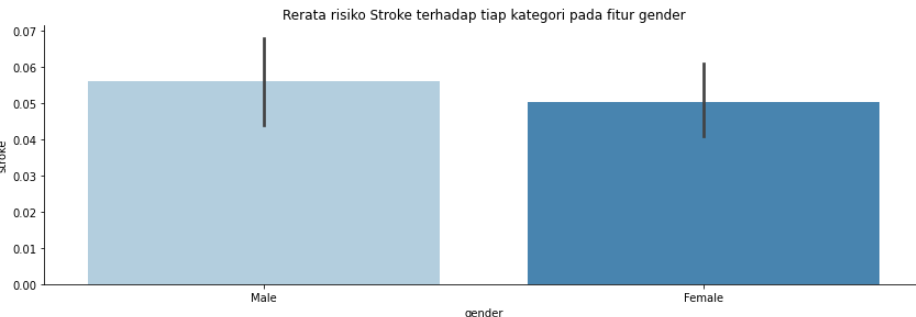 <br><br>
  Gambar 10 Catplot fitur stroke vs fitur ever_married: <br>
  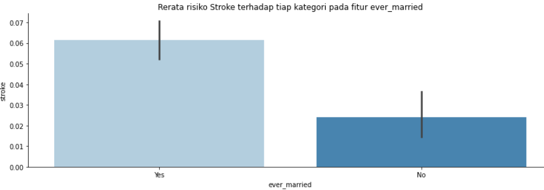 <br><br>
  Gambar 11 Catplot fitur stroke vs fitur work_type: <br>
  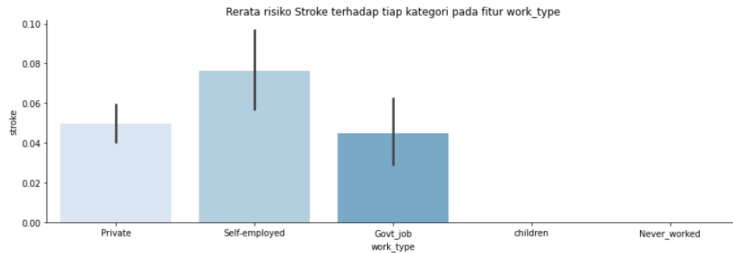 <br><br>
  Gambar 12 Catplot fitur stroke vs fitur Residence_type: <br>
  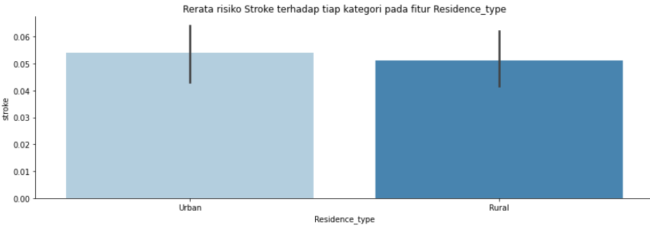 <br><br>
  Gambar 13 Catplot fitur stroke vs fitur smoking_status: <br>
  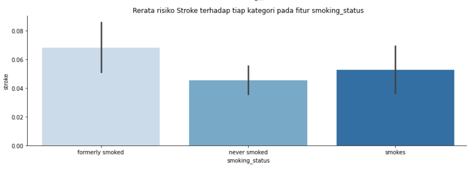 <br>
- memvisualisasikan korelasi fitur numerik dengan fitur target menggunakan heatmap <br>
  Gambar 14 Heatmap fitur numerik: <br>
  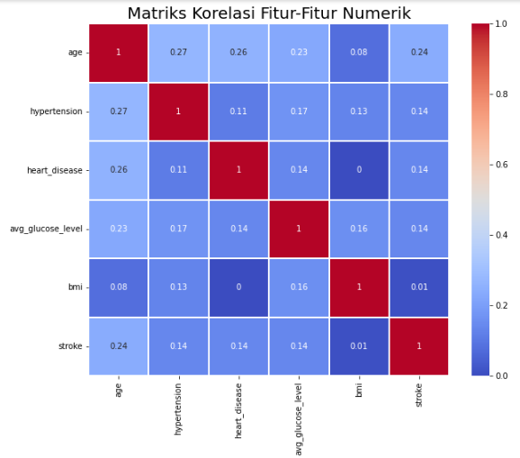

## Data Preparation ##
Tahap-tahap yang dilakukan dalam data preparation, adalah:
### Data Cleaning ###
Beberapa hal yang dilakukan pada tahap ini, adalah:
- Fitur id dihapus <br>
  Hal ini dilakukan karena fitur id hanya berisi primary key (identifier unik) yang tidak akan memengaruhi diagnosis stroke.
- Missing value dihapus <br>
  Missing value dideteksi dengan metode .info() dan dihapus dengan metode .dropna()
- Outlier dihapus <br>
  Outlier dideteksi di visualisasi boxplot terhadap fitur-fitur numerik. Melalui visualisasi boxplot yang telah dilakukan sebelumnya (Gambar 1-3), fitur avg_glucose_level (Gambar 2) dan bmi (Gambar 3) terdeteksi memiliki outlier. Outlier-outlier tersebut dihapus menggunakan metode IQR, dengan IQR adalah selisih antara kuartil atas dan kuartil bawah. x dikatakan sebagai outlier apabila memenuhi:
  ```
  x < Q1 - 1.5*IQR atau x > Q3 + 1.5*IQR
  
  ```
### Feature Selection ###
Beberapa hal yang dilakukan pada tahap ini, adalah:
- Kategori yang tidak memberikan insight berguna dari tiap fitur kategorik dihapus <br>
  Setelah melakukan visualisasi barplot dari tiap fitur kategorik (Gambar 4-8), distinct value beserta jumlah data untuk tiap value dapat diketahui. Kategori unknown dari fitur gender dan smoking_status dihapus, karena tidak memberikan insight yang berguna terhadap proyek.
- Fitur kategorik yang tidak berpengaruh terhadap fitur stroke dihapus <br>
  Fitur kategorik dikatakan tidak berpengaruh terhadap fitur stroke jika rerata risiko stroke terhadap kategori dari suatu fitur kategorik relatif sama. Untuk memudahkan pembandingan kriteria ini, visualisasi catplot digunakan. Dilihat dari catplot yang telah dibuat (Gambar 9-13), fitur kategorik yang tidak memenuhi persyaratan ini adalah fitur gender (Gambar 9) dan residence_type (Gambar 12), sehingga kedua fitur tersebut dihapus.
- Fitur numerik yang tidak berpengaruh terhadap fitur stroke dihapus <br>
  Fitur numerik dikatakan tidak berpengaruh terhadap fitur stroke jika skor korelasinya bernilai kurang dari 0.1. Untuk memudahkan pembandingan kriteria ini, visualisasi heatmap digunakan. Dilihat dari heatmap yang telah dibuat (Gambar 14), fitur numerik yang tidak memenuhi persyaratan ini adalah fitur bmi, sehingga kedua fitur dihapus.
### Data Transform ###
Beberapa hal yang dilakukan pada tahap ini, adalah:
- Label Encoding <br>
  Metode label encoding yang digunakan adalah One Hot Encoding. Dengan menggunakan metode ini, fitur kategorik diubah menjadi data kuantitatif, sehingga data dapat digunakan untuk pembelajaran model. Data dari satu fitur akan digenerasi menjadi fitur-fitur dengan jumlah setara dengan jumlah distinct value dari fitur tersebut. <br>
  Gambar 15 Fitur ever_married sebelum encoding <br>
  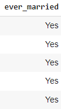 <br><br>
  Gambar 16 Fitur ever_married setelah encoding <br>
  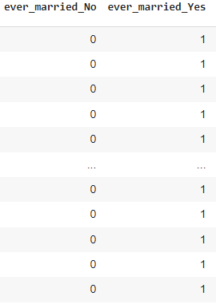 <br>
- Split dataset <br>
  Dataset dibagi menjadi data training dan testing dengan rasio 80:20. Angka ini dipilih, karena rasio ini rasio yang cukup mengingat dataset tidak terlalu besar.
- Normalisasi <br>
  Normalisasi mengubah nilai dari suatu fitur menjadi berada pada rentang 0 hingga 1. Sebuah nilai akan ditampilkan sebagai rasio antara selisih nilai tersebut dengan nilai minimal fitur dan selisih nilai maksimal dengan nilai minimal fitur, sebagai berikut. <br>
  


## Modeling ##
Model yang digunakan dalam proyek ini ada 2, yaitu KNN dan Random Forest.
- Model KNN melakukan klasifikasi dari suatu nilai dengan melihat klasifikasi dari titik-titik yang dekat dengan nilai tersebut. Kedekatan titik-titik data dengan suatu nilai diukur dengan formula jarak euclidean. Parameter n_neighbors mendefinisikan jumlah titik terdekat yang memengaruhi klasifikasi suatu nilai. Pada proyek ini, parameter n_neighbors yang digunakan adalah 5. Artinya, klasifikasi suatu nilai bergantung pada klasifikasi dari 5 titik data terdekat dari nilai tersebut. Apabila 3 titik data terdekat diklasifikasikan sebagai kategori 1, maka nilai tersebut akan diklasifikasikan sebagai kategori 1 juga. Nilai n_neighbors tersebut dipilih agar waktu training tidak terlalu lama.
- Model Random Forest melakukan klasifikasi dengan bantuan decision tree. Decision tree sendiri adalah metode klasifikasi suatu nilai dengan menanyakan pertanyaan-pertanyaan bertingkat mengenai kategori dari nilai tersebut. Hasil akhir dari decision tree adalah kategori klasifikasi dari nilai. Random Forest adalah metode klasifikasi yang menggabungkan hasil klasifikasi dari beberapa decision tree. Pada proyek ini, parameter n_estimators yang digunakan adalah 50. Artinya, klasifikasi suatu nilai bergantung pada klasifikasi dari 50 decision tree. Apabila 51 decision tree mengklasifikasikan nilai sebagai kategori 1, maka nilai tersebut akan diklasifikasikan sebagai kategori 1. Nilai n_estimators tersebut dipilih agar waktu training tidak terlalu lama. <br>

Melalui metrik-metrik evaluasi yang digunakan, model terbaik untuk diagnosis stroke adalah model KNN. Hal ini dikarenakan nilai accuracy untuk model KNN lebih besar daripada model Random Forest. Metrik MSE agak sulit untuk digunakan sebagai evaluator, karena model KNN mengalami underfit dan model Random Forest mengalami overfit.

## Evaluation ##
Metrik evaluasi yang digunakan ada 2, yaitu Mean Squarred Error dan Accuracy.
- Metrik MSE diterapkan pada data training dan testing untuk menentukan jenis fitting data yang terjadi. MSE mengukur rerata dari kuadrat dari selisih antara hasil prediksi dengan data sebenarnya. Model yang baik harus memiliki MSE pada data training dan testing yang tidak jauh berbeda. <br>
  Gambar 17 Formula MSE: <br>
  
- Metrik Accuracy diterapkan untuk menentukan akurasi model. Accuracy menghitung rasio antara jumlah prediksi yang benar (True Positive dan True Negative) dengan jumlah data testing. Model yang baik tentunya memiliki nilai accuracy yang besar.
  Gambar 18 Formula Accuracy: <br>
  

## Referensi ##
Delima, Mihardja LK, Ghani L. 2016. Faktor risiko dominan penderita stroke di indonesia. Buletin Penelitian Kesehatan. 44 (1): 49-58. doi: 10.22435/bpk.v44i1.4949.49-58
